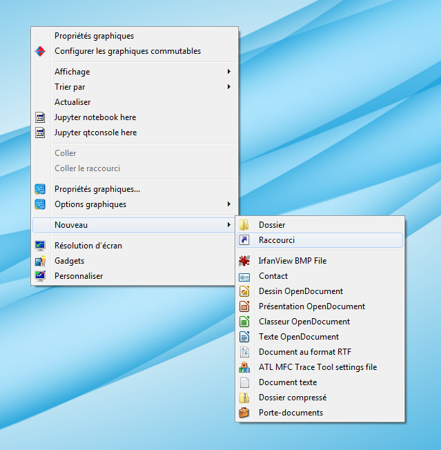

BeeActions
##########

BeeActions is a tool to help analyse actions performed by animals
(Bees for instance) and record the time when one of the registered
actions are done. A set of configurable shortcuts is used for quick
registration of the actions while a chrometer register the elapsed time
since the start of the acquisition

Overview
--------

BeeActions is written in `Python`__ and uses Python 3.5+. It uses the `PyQt5`__ library and the excellent `pyqtgraph`__ package
for its user interface. For BeeActions to run smoothly, you need a Python distribution to be installed. Here are some advices.

__ https://docs.python-guide.org/
__ http://doc.qt.io/qt-5/qt5-intro.html
__ http://www.pyqtgraph.org/

On all platforms **Windows**, **MacOS** or **Linux**, `Anaconda`__ or `Miniconda`__ is the advised distribution/package
manager. Environments can be created to deal with different version of packages and isolate the code from other
programs. Anaconda comes with a full set of installed scientific python packages while *Miniconda* is a very
light package manager.

__ https://www.anaconda.com/download/
__ https://docs.conda.io/en/latest/miniconda.html

Setting up a new environment
----------------------------

* Download and install Miniconda3.
* Open a console, and cd to the location of the *condabin* folder, for instance: ``C:\Miniconda3\condabin``
* Create a new environment: ``conda create -n my_env python=3.7``, where my_env is your new environment name, could be
*beeenv*. This will create the environment with python version 3.7 that is currently the recommended one.
* Activate your environment so that only packages installed within this environment will be *seen* by Python:
  ``conda activate my_env``
* Install, using conda manager, some mandatory packages: ``conda install pip`` and ``conda install pyqt``

Installing BeeActions
---------------------

Easiest part: in your newly created and activated environment enter: ``pip install beeactions``. This will install
BeeActions and all its dependencies.

Starting BeeActions
-------------------

Open a command line and **activate your environment** (if you're using anaconda or miniconda) and execute either:

*  ``python -m beeactions.main``

  .. _shortcut_section:

Creating shortcuts on **Windows**
---------------------------------

You can easily start BeeActions using the command line as stated above, but Windows users
will probably prefer using shortcuts on the desktop. Here is how to do it (Thanks to Christophe Halgand for the procedure):

* First create a shortcut (see :numref:`shortcut_create`) on your desktop (pointing to any file or program, it doesn't matter)
* Right click on it and open its properties (see :numref:`shortcut_prop`)
* On the *Start in* field ("Démarrer dans" in french and in the figure), enter the path to the condabin folder of your miniconda or
  anaconda distribution, for instance: ``C:\Miniconda3\condabin``
* On the *Target* field, ("Cible" in french and in the figure), enter this string:
  ``C:\Windows\System32\cmd.exe /k conda activate my_env & python -m beeactions.main``. This means that
  yout shortcut will open the windows's command line, then execute your environment activation (*conda activate my_env* bit),
  then finally execute and start **Python**, opening the correct beeactions file (here *main.py*,
  starting the Data analysis module, *python -m beeactions.main* bit)
* You're done!

   .. _shortcut_create:

   Create a shortcut on your desktop

   .. _shortcut_prop:

.. figure:: documentation/image/shortcut_prop.png
   :alt: shortcut properties

   Shortcut properties

